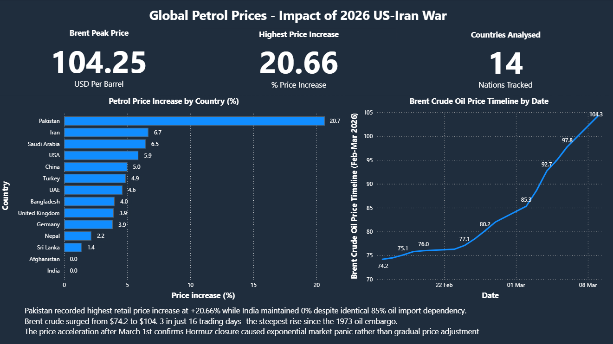
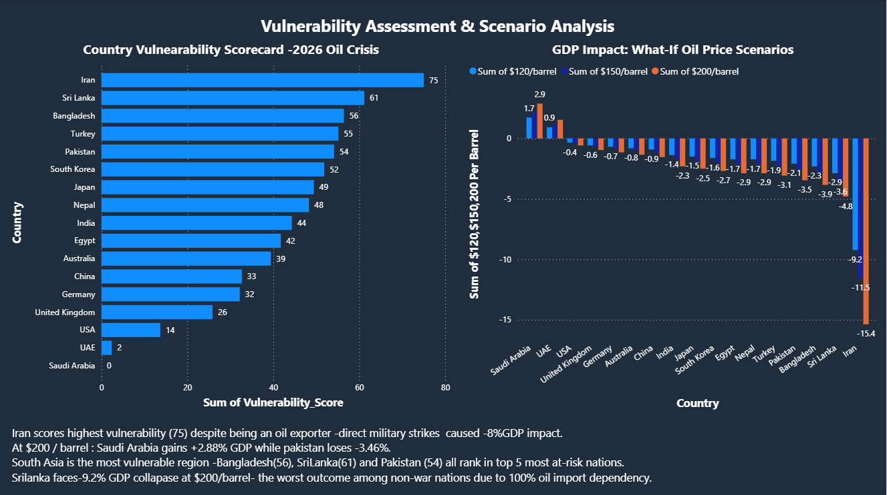

# ⛽ Global Petrol Prices Analysis — Impact of 2026 US-Iran Conflict

📊 A data-driven analysis of how geopolitical conflict impacts global fuel prices and economic stability.

---

## 📋 Overview

This project analyzes the impact of the 2026 US-Iran conflict on global petrol prices. Following geopolitical tensions and the closure of the Strait of Hormuz—responsible for nearly 20% of global oil supply—fuel prices increased significantly worldwide.

---

## 🎯 Objective

- Analyze petrol price changes before and after the conflict  
- Understand impact of oil supply disruptions  
- Evaluate country-level vulnerability  
- Study economic effects like inflation  

---

## ⭐ Project Highlights

- Real-world geopolitical case study  
- Multi-country petrol price comparison  
- Crude oil trend analysis (Brent & WTI)  
- Business impact evaluation  

---

## 🔥 Key Findings

- Brent crude: $104.25 (+51.5%)  
- WTI crude: $102.88 (+60.9%)  
- Pakistan highest increase: +20.66%  
- ~20% global oil supply disrupted  

---

## 📊 Analysis

- Price comparison (before vs after war)  
- Regional impact differences  
- Oil dependency vs price surge  
- Crude oil trend analysis  

---
## 📊 Power BI Dashboard

A Power BI dashboard was created to visualize:

- Petrol price changes across countries  
- Percentage increase in fuel prices  
- Crude oil price trends (Brent & WTI)  
- Country-level impact analysis

## 📷 Dashboard Preview

The dashboard provides an interactive view of how geopolitical events influenced global energy markets.

---
## 🧠 Conclusion

Geopolitical conflicts significantly disrupt global energy markets. Countries with high oil dependency are more vulnerable, highlighting the need for diversification and sustainable energy strategies.

---

## 🛠️ Tools Used

- Python (Pandas, NumPy)  
- Matplotlib / Seaborn  
- Colab Notebook
- PowerBI

---

## 👤 Author

**Aswin TS**  
Aspiring Business Analyst | Data Enthusiast 
